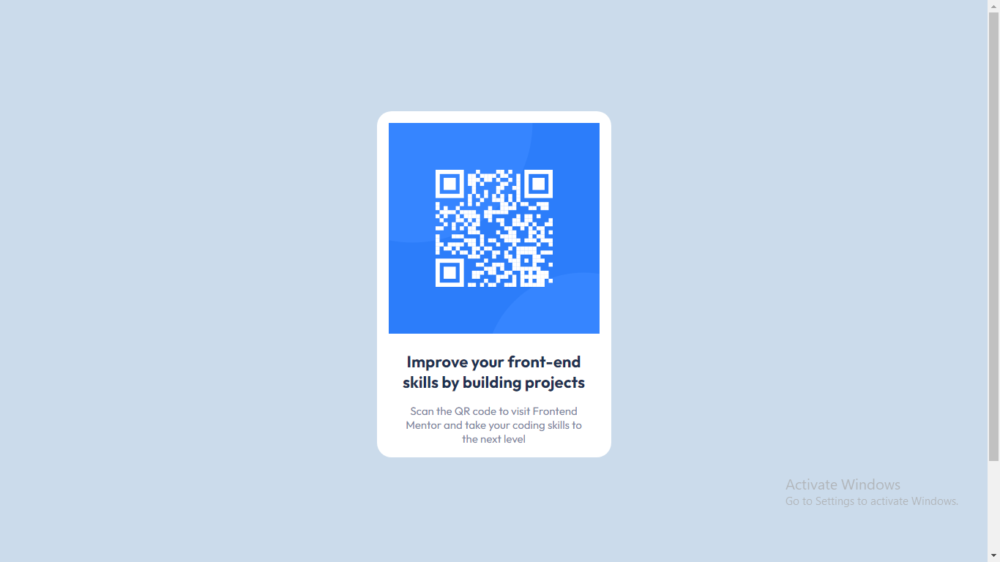
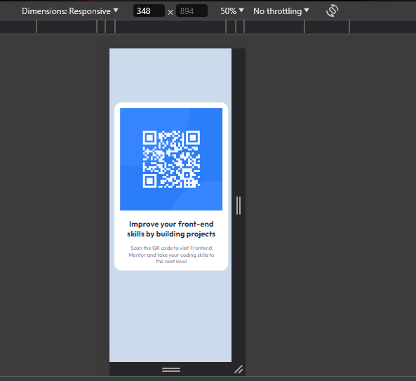

# Frontend Mentor - QR code component solution

This is a solution to the [QR code component challenge on Frontend Mentor](https://www.frontendmentor.io/challenges/qr-code-component-iux_sIO_H). Frontend Mentor challenges help you improve your coding skills by building realistic projects.

## Table of contents

-## Table of Contents

- [Overview](#overview)
- [Screenshots](#screenshots)
- [Links](#links)
- [Technologies Used](#technologies-used)
- [How to Use](#how-to-use)
- [Author](#credits)

## Overview

This QR code component is a simple solution to the [QR code component challenge on Frontend Mentor](https://www.frontendmentor.io/challenges/qr-code-component-iux_sIO_H). It provides users with a QR code to scan and visit Frontend Mentor's website.

### Screenshot

- Desktop View
  

- Mobile View
  

### Links

- Solution URL: [Add solution URL here](https://your-solution-url.com)
- Live Site URL: [Add live site URL here](https://your-live-site-url.com)

### technologies-used

- HTML
- CSS
- JavaScript
- Mobile-first workflow

## How to Use

1. Clone the repository:

```bash
git clone https://github.com/your-username/qr-code-component.git

2. Open the index.html file in your web browser.


### Author

- Frontend Mentor - [@Mohit-3007](https://www.frontendmentor.io/profile/Mohit-3007)
```
